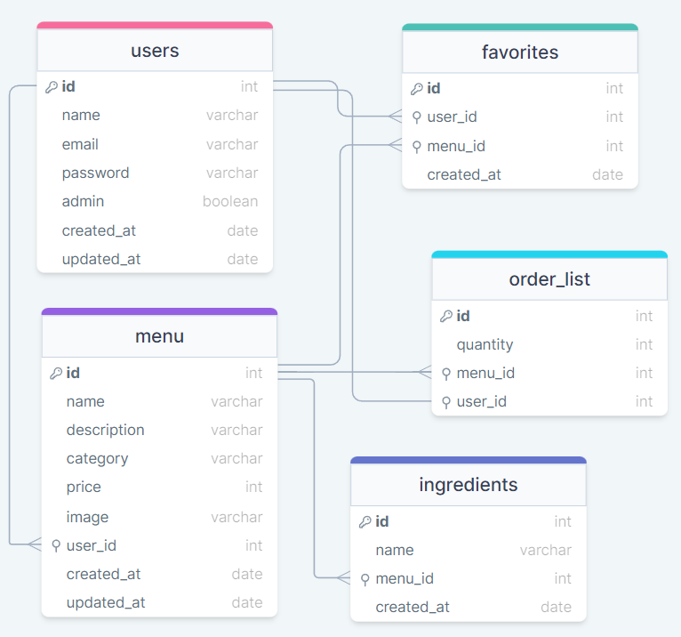

<h1 align="center">Food Explorer Backend</h1>

A Rest API build with Node.js and Express. This API have two types of users, a Admin and Customer. The Admin can Create, Edit and delete new dish to menu that contains a Name, image, category, ingredients, price and a description. The Customer can interact with the menu, view details, search, set as favorite and include on a order list.



## Technologies

- Node.js
- Express
- SQLite
- Knex
- Cors
- JWT

## Requisites

- [Node.js](https://nodejs.org/en)

## Setup

- Clone the repository;
- Install dependencies (`npm install`)
- Run application (`npm run dev`)

<br>

# <p align="center">HTTP</p>

## <p align="center">Menu</p>

### POST`/users`

Create a new user.

#### Request body

```json
{
  "name": "username",
  "email": "useremail@email.com",
  "password": "123456"
}
```

#### Authentication: `/sessions`

```json
{
  "email": "useremail@email.com",
  "password": "123456"
}
```

### GET`/menus`

#### Find a dish by query.

```http
/menus?name
```

#### Find a dish by ID.

```http
/menus/:id
```

### POST`/menus`

Create a dish.

#### Request body

```json
{
  "name": "dish name",
  "description": "dish description",
  "price": "12,34",
  "category:": "dish category",
  "ingredient": ["tag1", "tag2", "tag3"]
}
```

#### Add or update dish image.

```http
PATCH`/menus/img/:id`
```

### PUT`/menus/:menu_id`

Update a dish.

```json
{
  "name": "dish name",
  "description": "dish description",
  "price": "12,34",
  "category:": "dish category",
  "ingredient": ["tag1", "tag2", "tag3"]
}
```

### DELETE`/menus`

```http
/menus/:menu_id
```

## <p align="center">Favorites</p>

### GET`/favorites`

```http
/favorites/:user_id
```

### POST`/favorites`

```json
{
  "name": "product name"
}
```

### DELETE`/favorites`

```http
/favorites/:id
```

## <p align="center">Tags</p>

### GET`/tags`

```http
/tags/:menu_id
```

## <p align="center">Payment</p>

### GET`/payment`

```http
/payment/:user_id
```

### POST`/payment`

```json
{
  "quantity": "1",
  "menu_id": "1"
}
```

### DELETE`/payment`

```http
/payment/:id
```

<br>

[](https://choosealicense.com/licenses/mit/)
